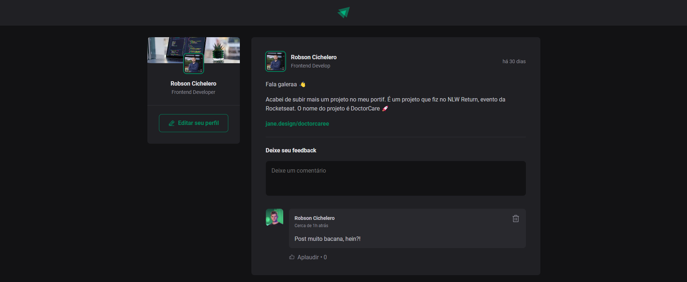
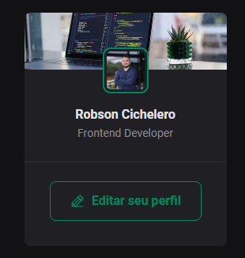
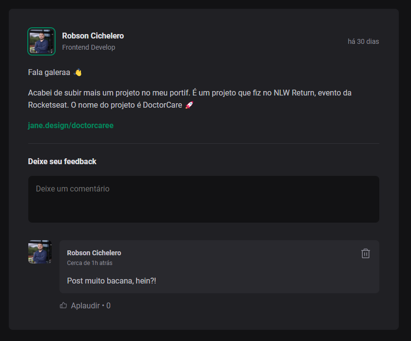

# ignite-feed
Project created during the Ignite, carried out by Rocketseat.

### Technologies Used
- React
- Vite
- Phosphoricons
- date-fns

## Application photos:
 
<div>
    
    <p style="display: flex; margin-top: 5px;" >
        
        
    </p>
</div>

### How to start the project.

run:
```bash
  yarn
```
and
```bash
  yarn dev
```
